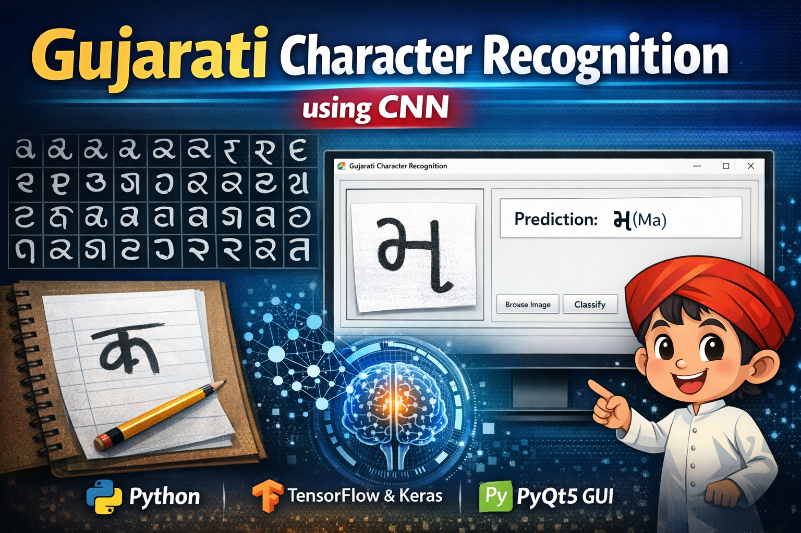

<p align="center">
  
</p>

# Gujarati Character Recognition using CNN

A Deep Learning based desktop application that recognizes Gujarati characters from images using a Convolutional Neural Network (CNN) with a PyQt5 graphical interface.

---

## Project Overview

This project uses a **Convolutional Neural Network (CNN)** to classify Gujarati handwritten characters from images.  
A **PyQt5 GUI application** allows users to easily upload images and classify characters.

The system can:

- Train a CNN model on Gujarati character datasets
- Predict characters from new images
- Display predictions through a graphical interface

---

## Technologies Used

- Python
- TensorFlow / Keras
- PyQt5
- OpenCV
- NumPy

---


---

## CNN Model Architecture

The model consists of:

- Multiple **Conv2D layers**
- **MaxPooling layers**
- **Batch Normalization**
- **Dropout layers**
- **Fully connected Dense layers**

The output layer uses **Softmax activation** for multi-class classification.

---

## Features

- GUI-based application
- Image browsing and preview
- CNN model training
- Real-time character classification
- Deep learning powered recognition

---
## 🔗 Links

- 💼 [LinkedIn](https://www.linkedin.com/in/senthamil45)
- 🌍 [Portfolio](https://senthamill.vercel.app/)
- 💻 [GitHub](https://github.com/selvan-01/gujarati-character-recognition.git)
- 
## Installation

Clone the repository:

```bash
git clone https://github.com/selvan-01/gujarati-character-recognition.git

Move to project folder:
cd gujarati-character-recognition

Install dependencies:
pip install -r requirements.txt

Running the Application
Run the GUI application:
python demo3.py

Steps:
Click Browse Image
Select Gujarati character image
Click Classify
The predicted character will appear

Model Training
To train the model:

Place dataset inside:
Dataset/train
Dataset/test

Click Training button in GUI.
The CNN model will start training using the dataset.

Example Workflow
1️⃣ Upload character image
2️⃣ CNN processes the image
3️⃣ Model predicts the character
4️⃣ Output displayed in GUI

Future Improvements
Support for handwritten Gujarati text recognition
Real-time camera input
Improved dataset and model accuracy
Web-based interface
